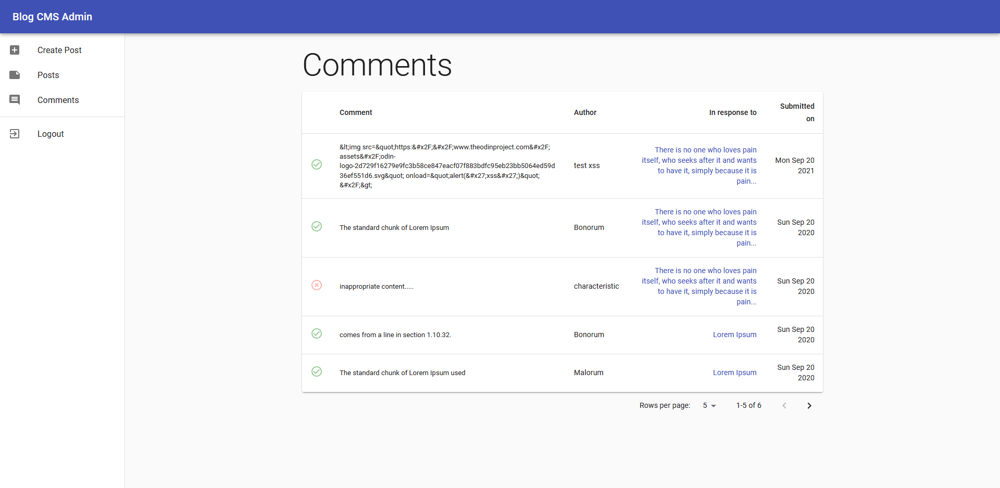
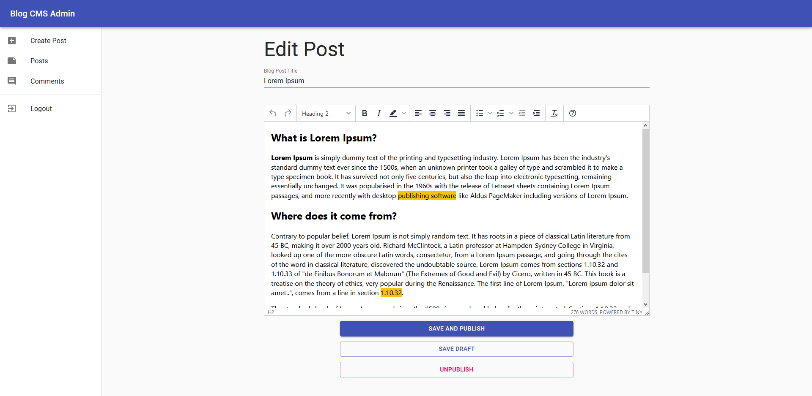

# blogcms-admin

Cms-admin is an app built with React which manages the content stored in blogcms-api server. Users can view all blog posts and all the comments. Admin user can publish/unpublish content on the blog. Create new posts, edit published or unpublished post, hide and unhide user comments. 

The app contains protected and unprotected application routes. Authentication is done using Json Web Token where user have a choice to store token in localStorage(does not need to re-authenticate every visit) or in memory (for better security).

API calls are cached to save unnecessary server calls for repeated page visits (within a session).

It is part of the headless cms system.

Headless blog CMS has an express server (api) that serves content, a Vue app (client) for rendering content and a React app (admin) for managing the content in the server (ie blog posts and comments). The system is communicating using REST API calls over HTTP.

View **CMS-client** [here](https://github.com/leoltl/blogcms-client)

View **CMS-api** [here](https://github.com/leoltl/blogcms-api)

## The stack
- **Client side**: React (hooks), React router dom
- **UI library**: Material UI, tinymce editor

## Live App
**View this app (admin) on [here](https://leoltl-blogcms-admin.herokuapp.com/)**
*The App is hosted on Heroku, it might take some to spin up the deno and the api deno, please wait a bit and retry if it does not work the first time*

**View client app [here](https://leoltl-blogcms-client.herokuapp.com/)**

**Sample profiles**

|username|password|
|---|---|
|admin|password|

## Features
**As an unauthenticated user**:
- I can see login page which allows me to put in credentials to login.

**As an authenticated user**:
- I can see all blog posts that I have published or saved as draft.
- I can create new post, edit existing post, and have the option to publish or save as draft.
- I can unpublish/ unapprove blog post or user comments to stop them from showing on the client site.
- I can see all comments that other user posts.

#### TODO
- support posting of images in comments
- add analytics calls to record post views
